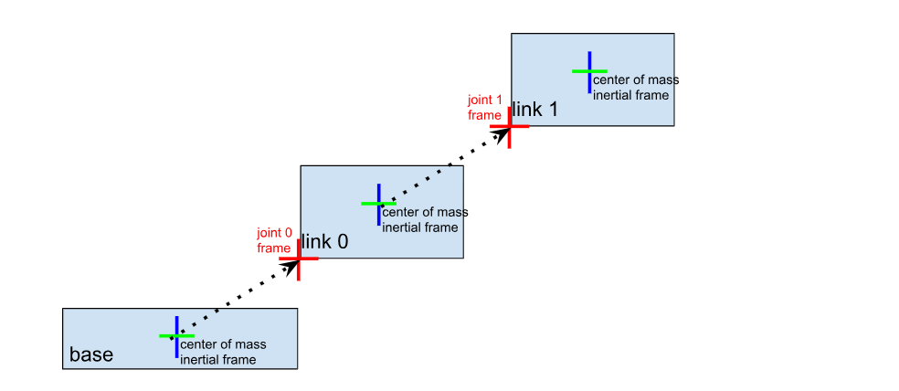

# PyBullet Notes
## 引言
### 目标：
- 机械臂工作台场景搭建
- 机械臂反馈与控制
- 物体状态与交互
- 使用RL训练机械臂夹取物体


## 开发环境搭建
#### 安装 MicroSoft C++ Build Tools
> https://blog.csdn.net/Oona_01/article/details/139567000
> 
> https://visualstudio.microsoft.com/zh-hans/visual-cpp-build-tools/

之后重启

#### 安装PyBullet
```bash
 pip install pybullet==3.2.5
```
指定安装3.2.5版本的，3.2.6似乎有问题

## 基础概念
- pybullet服务器常用操作
- URDF基本语法
- Transform
- 机器人结构

- 关节初步控制
- 机械臂运动学
- 碰撞检测
https://blog.csdn.net/weixin_44350205/article/details/109705590
- 抓取任务

